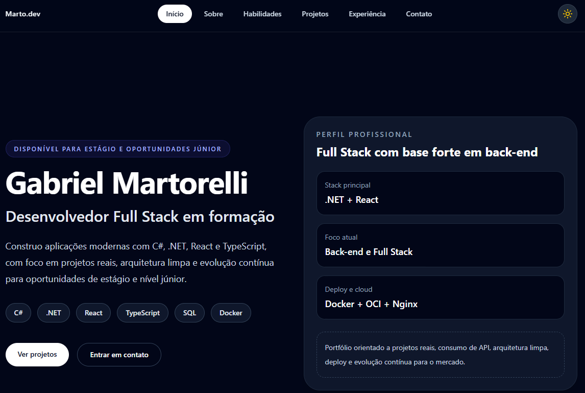

# Meu Portfolio

Portfólio profissional desenvolvido para apresentar meus projetos, habilidades técnicas e trajetória como desenvolvedor em formação, com foco em oportunidades de estágio e posições júnior em desenvolvimento **backend** e full stack.


## Sobre o projeto

Este repositório contém o código-fonte do meu portfólio pessoal, criado para reunir em um só lugar minha apresentação profissional, principais tecnologias, projetos em destaque e formas de contato. A proposta foi construir uma interface moderna, responsiva e objetiva, com visual limpo e foco em clareza para recrutadores e avaliadores técnicos.

O projeto foi pensado para funcionar como vitrine profissional na web, reforçando minha base em React, TypeScript e organização de frontend, ao mesmo tempo em que complementa meu foco principal em backend com .NET, APIs REST, SQL, Docker e infraestrutura.

## Acesso online

Aplicação publicada em produção:

**[https://app.martodev.online/](https://app.martodev.online/)**

## Preview

O portfólio inclui seções voltadas para apresentação profissional e navegação rápida:

- Hero section com posicionamento profissional e stack principal.
- Seção sobre mim com foco em trajetória e objetivo de carreira.
- Projetos em destaque com contexto técnico.
- Área de contato com links profissionais.
- Layout responsivo com tema visual moderno e deploy em produção.



## Tecnologias utilizadas

Este projeto foi desenvolvido com as seguintes tecnologias:

- **React**
- **TypeScript**
- **Vite**
- **Tailwind CSS**
- **Motion / animações de interface**
- **Vercel** para deploy

## Estrutura do projeto

```bash
gabriel-portifolio/
├── public/
├── src/
│   ├── components/
│   ├── sections/
│   ├── data/
│   ├── assets/
│   ├── styles/
│   └── main.tsx
├── index.html
├── package.json
├── tsconfig.json
└── vite.config.ts
```

## Funcionalidades

- Apresentação profissional em formato de portfólio web.
- Exibição de stack principal e tecnologias de interesse.
- Seção de projetos com foco em demonstração prática.
- Layout responsivo para desktop e mobile.
- SEO básico com metadados e domínio customizado.
- Deploy contínuo com Vercel.

## Objetivo

O principal objetivo deste projeto é servir como minha vitrine profissional para processos seletivos, networking e compartilhamento de projetos. Ele foi construído para transmitir organização, clareza e evolução técnica, alinhado ao meu foco em desenvolvimento backend com .NET e também em experiências full stack com React e TypeScript.

## Como executar localmente

### 1. Clone o repositório

```bash
git clone https://github.com/martoxm/gabriel-portifolio.git
```

### 2. Acesse a pasta do projeto

```bash
cd gabriel-portifolio
```

### 3. Instale as dependências

```bash
npm install
```

### 4. Rode o projeto em ambiente local

```bash
npm run dev
```

### 5. Gere a build de produção

```bash
npm run build
```

### 6. Visualize a build localmente

```bash
npm run preview
```

## Deploy

A aplicação está hospedada na Vercel com domínio customizado:

**[https://app.martodev.online/](https://app.martodev.online/)**

## O que este projeto demonstra

Este portfólio foi criado para demonstrar:

- Capacidade de estruturar um frontend moderno com React e TypeScript.
- Organização de componentes e seções reutilizáveis.
- Cuidado com responsividade, apresentação visual e experiência do usuário.
- Preocupação com deploy, domínio customizado e presença profissional online.
- Comunicação clara de perfil técnico, projetos e objetivo de carreira.

## Contato

- **Portfólio:** [https://app.martodev.online/](https://app.martodev.online/)
- **GitHub:** [https://github.com/martoxm](https://github.com/martoxm)
- **LinkedIn:** [https://www.linkedin.com/in/gabrielmartorelli/](https://www.linkedin.com/in/gabrielmartorelli/)
- **E-mail:** gabriel.martorelli@hotmail.com

## Licença

Este projeto está sob a licença MIT, caso você opte por disponibilizá-lo dessa forma no repositório.

---

Desenvolvido por **Gabriel Luiz de Figueiredo Martorelli** com foco em evolução constante, boas práticas e construção de um portfólio sólido para o mercado de tecnologia.
